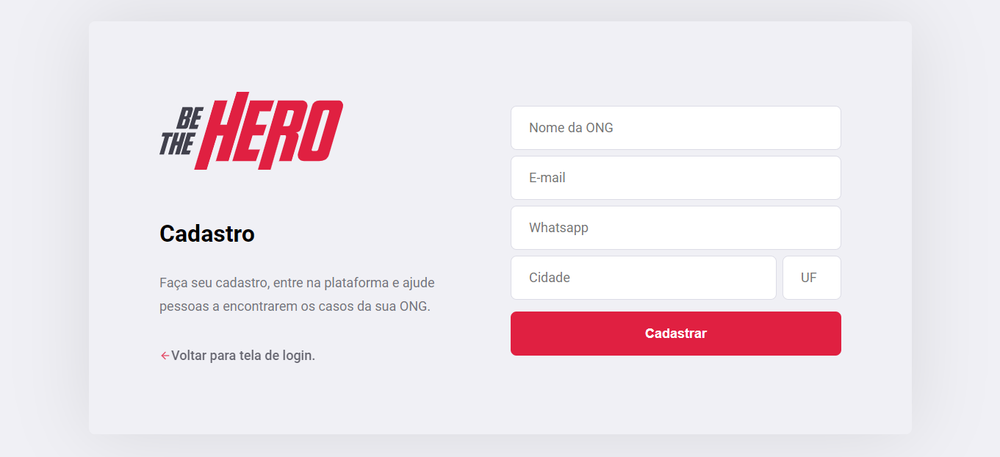

# be-the-hero

## Aplicação feita através da Semana Omnistack 11, utilizando as seguintes tecnologias em nível intermediário: NodeJS, React, React Native, SQLite.

Front-end: React

Back-end: NodeJS

Mobile: React Native

Banco de Dados: SQLite

Testes Automatizados: Jest

Essa projeto é capaz de fornecer o meio termo entre ONGs e pessoas capazes de ajudar financeiramente com doações em casos específicos.

Como o projeto funciona?

1 - A ONG se cadastra;

2 - Depois de cadastrada, a ONG consegue cadastrar os casos que necessitam de ajuda financeira, deixando explícito o valor necessário para os casos. 
    O cadastro de ONGs e casos são feitos pela aplicação web.
    
3 - Após os casos serem cadastrados, estarão disponíveis para visualização na aplicação mobile e nela as pessoas são capazes de encontrar um meio de
    comunicação com a ONG detentora do caso através do WhatsApp ou E-mail para determinarem como será feita a transação financeira.
    
   
## Telas da Aplicação WEB:

### Tela de Login:

### Tela de Cadastro de ONGs:

### Tela 'Home':

### Tela de Cadastro de Novos Casos:

## Telas da Aplicação MOBILE:

### Tela 'Home':

### Tela de detalhes do caso:

### Outras tecnologias usadas no projeto:

#### Backend:

**express** - Biblioteca que cria abstrações de rotas, middlewares e muitas outras funções para facilitar a criação tanto de API's quanto SPA's. Express está voltado para
              a criação e obtenção dos dados a partir do seu servidor.

**nodemon** - Basicamente ele é um file watcher que roda internamente o próprio comando node. A diferença entre usá-lo ou usar o comando node é que ele faz auto-restart
              da aplicação, toda vez que um arquivo do projeto for modificado.
         
**knex** - Biblioteca para a manipulação de bancos de dados SQL (Query Builder).

**celebrate** - Biblioteca usada para fazer validações de todos os tipos de parâmetros que são transportados através das rotas.

**jest** - Biblioteca usada para realizar testes automatizados, tanto testes de integração, como testes unitários.

**cross-env** - Consegue realizar a manipulação de variáveis de sistema.

#### Frontend:

**react-icons/fi** - Biblioteca de ícones usada nesse projeto.

**axios** - Axios é um cliente HTTP, que funciona tanto no browser quanto em node.js. A biblioteca é basicamente uma API que sabe interagir tanto com XMLHttpRequest quanto 
            com a interface http do node. (Foi usado no Front e no Back).

**react-toastify** - Biblioteca para enviar notificações animadas em tela, como de error, success e warning.

#### Mobile:
**expo** - O Expo é uma ferramenta utilizada no desenvolvimento mobile com React Native que permite o fácil acesso às API's nativas do dispositivo sem precisar instalar qualquer 
           dependência ou alterar código nativo.
           
**expo-constants** - fornece informações do sistema que permanecem constantes durante toda a vida útil da instalação do seu aplicativo.

**expo-mail-composer** - Permite compor e enviar emails de maneira rápida e fácil usando a interface do usuário do sistema operacional. 
